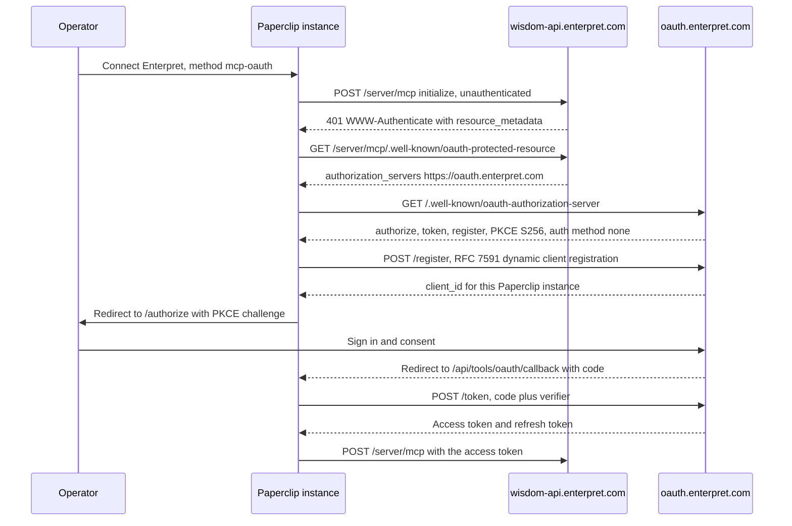

# Enterpret connection

Enterpret's hosted MCP server answers questions about an organization's customer
feedback — themes, accounts, sentiment, and verbatim quotes with citations back
to the source records.

This document follows the template in
[Connection Authoring Runbook](./CONNECTOR-PLAYBOOK.md) and records exactly what
was and was not verified. **The connector has never been exercised against a
real Enterpret account.** It ships unavailable for that reason — withheld from
the Apps store *and* refusing setup — so nothing can start a flow that has never
been tested. See [Validation Hook](#validation-hook).

Authored against Paperclip App `fff410dfe777ae0427385e8297df992ba9aed4ce`, with
`CONNECTOR-PLAYBOOK.md` blob `5efd4cca05a1c94bb47d619833ba347f416bbbed` as the
authority. Provider metadata read 2026-09-23.

## Vendor

- App key: `enterpret`
- App name: Enterpret
- Owner: unassigned. No Paperclip maintainer currently owns an Enterpret account.
- Reuse classification: **MCP-direct**
- Reason for classification: Enterpret publishes an official hosted MCP server
  over Streamable HTTP whose authorization server is discoverable from the
  endpoint itself. No REST shim and no vendor-specific wrapper is needed; the
  tools map onto ordinary read grants.
- Security tier: **S3**
- Plugin needed? No. The provider is expressible as metadata plus a transport:
  no plugin tables, workers, webhooks, or dedicated UI.

### Why a catalog entry at all

An operator can already reach this server with no Paperclip code change, through
**Connect your own MCP server** or **Advanced → Paste a config**
([Generic remote MCP](./GENERIC-REMOTE-MCP.md)). The catalog entry adds only:
official artwork, two labelled methods with the correct client-ownership and
grant-identity shape, a reviewed scope allowlist narrower than the advertised
set, a recorded risk tier, and the provider docs link. Those are real but
incremental. Treat the generic path as the baseline, not as a lesser fallback.

## Transport And Auth

- Transport: `mcp_remote` (Streamable HTTP)
- Endpoint: `https://wisdom-api.enterpret.com/server/mcp`. The bare and
  trailing-slash forms behave identically — `401`, no redirect.
- Auth modes: **OAuth** (`mcp-oauth`) and **API key** (`mcp-api-key`). Both are
  documented by the provider.
- OAuth scopes: requested `mcp:read`. Advertised by the provider: `email`,
  `mcp:read`, `mcp:write`. See [Scope decision](#scope-decision).
- Key scope: the Enterpret auth token is generated per Enterpret organization
  and carries that organization's access. Enterpret does not document a
  restricted or read-only token variant.
- Credential owner: OAuth is user-delegated (`grantKinds: ["user"]`); the auth
  token is an organization credential (`grantKinds: ["organization"]`).
- Secret storage: `company_secrets` refs only. The definition records the header
  placement, never a value.
- Revocation behaviour: **no `revocation_endpoint` is advertised.** See
  [Revocation gap](#revocation-gap).

### Connection Flow (mandatory)



- Auth endpoints (exact paths), all read from provider metadata on 2026-09-23:
  - Authorize: `https://oauth.enterpret.com/authorize`
  - Token: `https://oauth.enterpret.com/token`
  - Registration (DCR): `https://oauth.enterpret.com/register`
  - Discovery: `https://wisdom-api.enterpret.com/server/mcp/.well-known/oauth-protected-resource`
    (RFC 9728) → `https://oauth.enterpret.com/.well-known/oauth-authorization-server`
    (RFC 8414). `https://oauth.enterpret.com/.well-known/openid-configuration`
    also resolves.
  - Also advertised: `/introspect`, `/userinfo`. `jwks_uri` points at AWS Cognito
    pool `us-east-2_kLiRrPBis`.
  - Paperclip callback: `/api/tools/oauth/callback`
- Redirect constraints: `https-or-loopback-http` in the definition. This is
  **unprobed** against Enterpret — establishing the provider's real constraint
  means attempting registration, which has not been authorized.
- Paperclip ID / Paperclip Connect involvement: **none.** Enterpret is an
  RFC 7591 DCR provider, so registration is instance-local and Cloud and
  self-hosted use the same path. The only per-instance difference is the
  hostname inside the redirect URI.

The definition ships `serverUrl` only. A complete `authorizationEndpoint` +
`tokenEndpoint` pair would be authoritative and would suppress discovery
permanently, including endpoints a previous discovery had persisted. Discovery
resolves cleanly here — the `issuer` in the RFC 8414 document matches the issuer
used to build the URL — so there is nothing to hard-code and nothing to keep
current.

### Scope decision

The `401` challenge advertises `scope="mcp:read mcp:write"`. The definition
requests `mcp:read` alone.

Every documented tool is read-shaped, and nothing observed establishes a write
need. The narrower request is the reviewed minimum the runbook asks for. Two
costs, stated plainly:

1. If any Enterpret tool needs `mcp:write` at call time, it will fail. That is
   the intended trade.
2. **Unprobed risk:** if Enterpret's resource server requires a token carrying
   both scopes, the connection itself may fail rather than degrade. Nobody has
   run the flow. If live validation shows this, the fix is a reviewed widening
   to `mcp:write` with the reason recorded — not a silent one.

`email` is deliberately not requested. A connector is a plane P2 resource
credential and never a sign-in authenticator ([README](./README.md)).

### Revocation gap

The RFC 8414 document advertises no `revocation_endpoint`. Removing the
connection in Paperclip clears local credential material and gateway access, but
there is no documented provider-side instrument to invalidate an issued token.
For the auth-token method, the equivalent action is generating a replacement
token in the Enterpret dashboard.

Consequence: runbook scenario **Revoke and reconnect** cannot reach `verified`
on any deployment through a provider-side revocation call. Local removal is
still testable, and should be recorded as exactly that rather than as full
revocation.

## Administrator Setup (mandatory)

- What the admin must register: **nothing.** Enterpret advertises RFC 7591
  dynamic client registration, so the Paperclip instance registers itself at
  connect time. No client ID, no client secret, no callback URL to pre-register.
- Where to register it: not applicable. For the auth-token method, an Enterpret
  admin generates a token at **Settings → Enterpret MCP → Generate** under
  **Auth Token**. Tokens expire six months after generation.
- Instance prerequisites: outbound HTTPS to `wisdom-api.enterpret.com` and
  `oauth.enterpret.com`. A public HTTPS base URL is **not** required — that
  applies to the Client ID Metadata Document tier only, and an instance without
  one falls through to DCR.
- How to verify the connection works: after connecting, the connection health
  and catalog check should list Enterpret's tools. `get_organization_details`
  is the narrowest read and identifies which Enterpret organization the
  credential resolves to — run that first, and confirm it is the organization
  you intended.

## Resource Filters

- Required filters: none expressible. Enterpret's MCP surface scopes every call
  to the organization behind the credential; the server documents no per-source,
  per-account, or per-workspace request parameter.
- Optional filters: none.
- Write-enabling filters: not applicable — no write action is exposed.
- Filters enforced by: **the credential itself.** The account boundary is the
  only boundary, which is why the organization a credential resolves to has to
  be confirmed at setup rather than assumed.

## Manifest

- schemaVersion: 1
- slug: `enterpret`
- name: Enterpret
- description: "Ask questions about your customer feedback and pull verbatim
  quotes with citations."
- categories: `["analytics"]`
- branding and provenance: `/brands/apps/enterpret.png`. The official Enterpret
  app icon, 256×256, retrieved 2026-09-23 from the `apple-touch-icon` linked by
  `https://www.enterpret.com/`, unmodified.
  SHA-256 `aca19ddae5f52a2caa4f3664286a76cd9439316e0fa3c39890f646536aebc522`.
  The provider's nav logo is a 120×24 light-on-dark wordmark, wrong shape for a
  square tile and unusable on a light frame; the app icon is the correct
  official mark and needs no dark variant.
- docsUrl: `https://enterpret.support.site/article/enterpret-mcp-server`
- Methods:

| | `mcp-oauth` | `mcp-api-key` |
| --- | --- | --- |
| label | Sign in with Enterpret | Use an auth token |
| transport | `mcp_remote` | `mcp_remote` |
| auth | `oauth` | `api_key` |
| ownershipModes | `["dcr"]` | `["customer"]` |
| grantKinds | `["user"]` | `["organization"]` |
| defaults | `serverUrl`, `scopesHint: ["mcp:read"]` | `serverUrl` |
| credentialFields | — | `authorization`, password, required, secret |
| keyPlacement | — | header `Authorization`, prefix `Bearer ` |
| riskTier | S3 | S3 |

  `ownershipModes` omits `customer` on the OAuth method on purpose: Enterpret
  documents no way for a customer to register their own OAuth application, and
  `ownershipModes` must reflect what the provider advertises rather than the
  `method()` helper's `["customer", "dcr"]` default.

- oauthStrategy and connectorProfile: not used. This is not a Paperclip-managed
  OAuth provider.
- capabilityProfile and variants: not needed.
- tenantFields and extensionFields: none. There is no tenant identifier to
  supply — the credential determines the organization.
- credentialSources: none. Not Vercel Connect eligible.
- configRequirements: none.
- guidanceMd, warnings, consoleLinks: see the generated definition at
  `packages/shared/src/app-definitions/enterpret.json`.
- riskTier: S3. Enterpret exposes broad content access — an organization's
  complete customer feedback corpus including verbatim quotes with speaker
  attribution. It is not S4: no payments, external sends, refunds, production
  deployment, deletion, or tenant-wide administration is documented.
- requiredResourceFilters: none, for the reason in
  [Resource Filters](#resource-filters).
- urlPatterns: `["https://wisdom-api.enterpret.com/*"]`
- setupPrerequisite: not used; the account requirement is carried in method
  warnings.
- redirectConstraints: `https-or-loopback-http` (unprobed).
- availability: `{ available: false, reason }`. Two separate guards, because
  they do different jobs. `APP_STORE_HIDDEN_SLUGS` removes the card from Browse
  but leaves the slug directly connectable by URL or slug lookup.
  `availability.available === false` is what actually refuses setup:
  `preflightGalleryAppMetadata` returns `App not found`
  (`server/src/services/tool-access.ts:16560`), and the setup flow and Browse
  both render the reason instead of a Connect action
  (`ui/src/features/connections/ConnectionSetupFlow.tsx:2857,2935,3464`,
  `ui/src/pages/apps/Browse.tsx:243`). Neither guard deletes the definition, so
  an existing connection would keep working if one existed.

## Actions

**Documented, not observed.** Nobody has run an authenticated `tools/list`, so
every row below comes from the provider's article and none of it is confirmed
against the live server. Risk is Paperclip's classification of the documented
description, not a provider annotation.

| Tool | Risk | Default status | Filters | Approval default | Audit fields | Negative case |
| --- | --- | --- | --- | --- | --- | --- |
| `get_organization_details` | read | active | credential org | allow | actor, run, connection, tool, outcome | ungranted actor is denied before dispatch |
| `get_graph_schema` | read | active | credential org | allow | same | same |
| `get_query_examples` | read | active | credential org | allow | same | same |
| `search_graph_fields` | read | active | credential org | allow | same | same |
| `search_graph_values` | read | active | credential org | allow | same | same |
| `run_graph_query` | **unclassified** | active | credential org | allow | same, plus redacted query shape | same |
| `find_user_quote` | read | active | credential org | allow | same, plus quote redaction | same |

Legacy aliases `get_schema`, `execute_cypher_query` and `search_knowledge_graph`
remain served for the lifetime of an existing session and are dropped when the
host refreshes its tool list.

`run_graph_query` is deliberately left unclassified rather than called read.
Three things say it cannot be assumed read-only: it is the rename of
`execute_cypher_query`, Cypher is not a read-only language, and the advertised
scope set includes `mcp:write`. Do not infer a permission from a tool name.
Classifying it needs an authenticated `tools/list` with annotations, and until
then the entry stays out of the store.

Redaction plan: `find_user_quote` returns verbatim customer text with speaker
attribution, and `run_graph_query` can return feedback records. Neither result
should appear in an evidence artifact, a screenshot, a log, or a PR. Record tool
name, count, decision and outcome code — never payload content.

## Wizard Path

- User path (OAuth): gallery card → Connect → Enterpret consent in the browser →
  callback → access defaults.
- User path (auth token): gallery card → paste the token from
  **Settings → Enterpret MCP** → access defaults.
- Configuration steps: none beyond credentials. There is no tenant field to
  fill.
- Error states: expired auth token (six-month lifetime); an account with no
  access to the organization's feedback; a scope rejection if the reviewed
  read-only request is refused (see [Scope decision](#scope-decision)).
- Redacted metadata shown: endpoint origin and path, method key, resolved
  Enterpret organization from `get_organization_details`, tool names and count.
  Never the token, the authorization code, or feedback content.

## Governance Defaults

- Default profile: the central `recommendedDefaultsForApp` — every discovered
  action enabled and Allowed. No provider-local override.
- Profile bindings: standard. Nothing Enterpret-specific.
- Policies: none added. Because `run_graph_query` is unclassified rather than
  proven read-only, an operator connecting this provider should consider setting
  that action to **Ask first** until an authenticated catalog confirms its
  behaviour. That is guidance, not a shipped policy.
- Quarantine rules: `quarantineNewEntries` is connection-level runtime setup,
  not an `AppDefinition` field, so this entry cannot declare it. Enterpret's
  catalog demonstrably drifts — it renamed three tools and kept the old names as
  session-scoped aliases — so an operator should enable quarantine on the
  connection.
- Rate limits: none set.

## Validation Hook

- Environment: none. **No live Enterpret account exists**, in the company secret
  catalog (101 entries, zero Enterpret rows), bound to any agent, or as an
  installed connection.
- Method keys: `mcp-oauth`, `mcp-api-key`
- Date and tested commit: 2026-09-23, App `fff410dfe777ae0427385e8297df992ba9aed4ce`
- Reproduction steps for what *was* executed:

```sh
curl -s -i -X POST https://wisdom-api.enterpret.com/server/mcp \
  -H 'Content-Type: application/json' \
  -H 'Accept: application/json, text/event-stream' \
  -d '{"jsonrpc":"2.0","id":1,"method":"initialize","params":{"protocolVersion":"2025-06-18","capabilities":{},"clientInfo":{"name":"probe","version":"0"}}}'
curl -s https://wisdom-api.enterpret.com/server/mcp/.well-known/oauth-protected-resource
curl -s https://oauth.enterpret.com/.well-known/oauth-authorization-server
```

### Nine production-validation scenarios

Per deployment, self-hosted first. Cloud has no evidence of any kind and is
never inferred from a self-hosted result.

| Scenario | Self-hosted, same machine | Self-hosted, server/VPS | Cloud |
| --- | --- | --- | --- |
| Setup and consent | not run — no account | not run — no account | not run — no Cloud instance |
| Authentication | not run — no account; DCR against the live `/register` is not authorized | not run — same | not run |
| Catalog and configuration | not run — needs an authenticated `tools/list` | not run — same | not run |
| Allowed execution | not run — no account | not run — same | not run |
| Denied execution | not run — needs a live connection to deny against | not run — same | not run |
| Runtime delivery | not run — no account | not run — same | not run |
| Refresh and recovery | not run — no account | not run — same | not run |
| Revoke and reconnect | **not applicable** for provider-side revocation — no `revocation_endpoint` is advertised. Local removal is not run. | not applicable / not run — same | not run |
| Activity and secret handling | **partially executed** — the committed definition is asserted credential-free by an automated canary. Live activity and log inspection: not run. | not run | not run |

Offline authoring legitimately produces a column of "not run". What it must not
produce is a blank or an optimistic one.

### Deployment support matrix

Labels as defined in the connector skills' shared matrix.

| Capability | Self-hosted, same machine | Self-hosted, server/VPS | Cloud |
| --- | --- | --- | --- |
| Definition generates, validates and typechecks | `verified` | `verified` | `verified` — the checks are deployment-independent |
| Official branding passes the artwork checks | `verified` | `verified` | `verified` |
| Provider metadata discovery resolves (RFC 9728 → 8414) | `verified` against the provider, from this runtime | `verified` — same request, no deployment dependency | `untested` |
| Paperclip's discovery ladder resolves this shape | `deferred` — PAP-18519 exercises it against a local mirror | `deferred` — same | `untested` |
| DCR client registration | `untested` — deliberately not attempted; registering a client at Enterpret is not authorized | `untested` — same | `untested` |
| OAuth consent and token exchange | `untested` — no account | `untested` | `untested` |
| Auth-token (header) connection | `untested` — no token | `untested` | `untested` |
| Authenticated `tools/list` | `untested` — blocks the risk classification of `run_graph_query` | `untested` | `untested` |
| Agent execution through the gateway | `untested` | `untested` | `untested` |
| Provider-side revocation | `unsupported` — the authorization server advertises no `revocation_endpoint` | `unsupported` | `unsupported` |
| Store visibility | `deferred` — withheld until live validation passes | `deferred` | `deferred` |

### What must happen before this is store-visible

1. An authorized Enterpret organization credential, held by a named owner, with
   least privilege established from evidence rather than from scope names.
2. An authenticated `tools/list`, to replace the documented tool table with an
   observed one and to classify `run_graph_query`.
3. Authorization to attempt DCR against `oauth.enterpret.com`, or a decision to
   validate the auth-token method only.
4. The nine scenarios re-run and recorded here.
5. Clear `availability` in the Enterpret tuple in
   `scripts/ingest-app-definitions.mjs`, remove `"enterpret"` from
   `APP_STORE_HIDDEN_SLUGS` in `packages/shared/src/app-definitions.ts` and from
   the sorted list in `packages/shared/src/app-definitions.test.ts`, set
   `catalogVisible: true` in `ui/public/brands/apps/manifest.json`, drop the two
   `availability` assertions from the focused test, and bump
   `APP_STORE_DEFINITIONS` from 52 to 53.

Steps 1 and 3 are authorization decisions, not engineering work.
